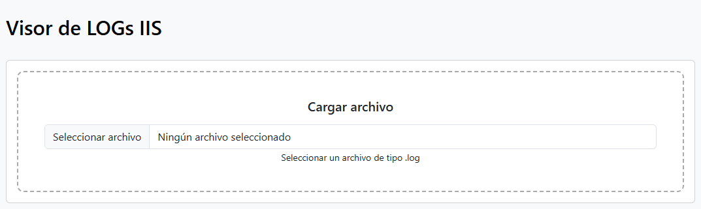
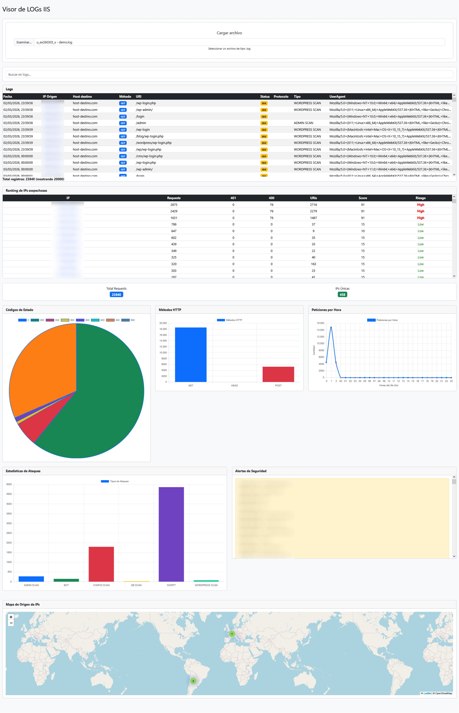
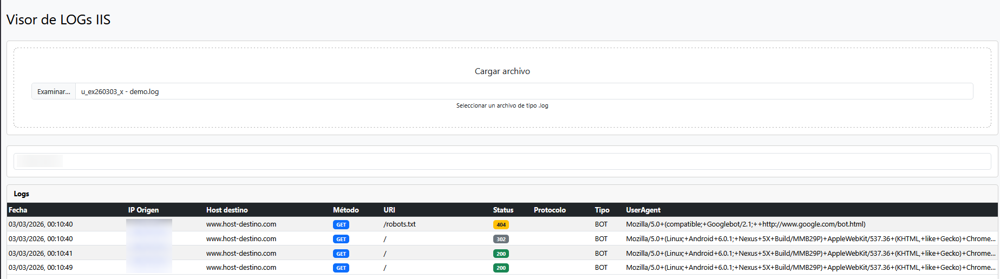

# IIS Log Analyzer (Client-Side)

🇪🇸 Español | 🇬🇧 [English](README.md)

Herramienta web para analizar archivos de logs de **Microsoft IIS** directamente en el navegador.
Permite visualizar métricas, detectar patrones de ataque y explorar registros sin necesidad de subir archivos a un servidor.

Todo el procesamiento se realiza **del lado del cliente (JavaScript)**.

## Características

* Análisis de archivos de log de IIS
* Procesamiento **100% en el navegador**
* Visualización de métricas mediante gráficos
* Tabla interactiva de registros
* Filtro rápido por IP
* Identificación automática de:

  * Bots
  * Scanners
  * Posibles ataques
  * IP privadas no son tomadas en cuenta para los análisis
* Ranking de IPs
* Detección de posibles ataques de fuerza bruta
* Mapa de origen de tráfico

## Gráficos disponibles

* Distribución de **códigos de estado HTTP**
* Distribución de **métodos HTTP**
* **Peticiones por hora**
* Tipos de **ataques detectados**

Los gráficos se generan utilizando **Chart.js**.

## Formato de log soportado

Logs generados por **Microsoft IIS** con el formato estándar W3C.

Ejemplo:

```
#Fields: date time s-ip cs-method cs-uri-stem cs-uri-query s-port cs-username c-ip cs(User-Agent) sc-status sc-substatus sc-win32-status time-taken
2026-03-07 10:15:32 192.168.1.10 GET /index.html - 80 - 203.0.113.15 Mozilla/5.0 200 0 0 45
```

## Uso

1. Abrir la página en el navegador
2. Seleccionar un archivo de log de IIS
3. El sistema procesará el archivo automáticamente
4. Se mostrarán:

* métricas
* gráficos
* registros del log

## Filtrado

Es posible filtrar registros mediante:

* campo de búsqueda
* click sobre una IP en la tabla

## Rendimiento

El parser está optimizado para manejar archivos grandes (mejoras pendiente).

Optimizaciones implementadas:

* reutilización de `Intl.DateTimeFormat`
* renderización optimizada de tablas
* destrucción de instancias de gráficos

## Tecnologías utilizadas

* HTML5
* CSS
* JavaScript
* Bootstrap
* Chart.js
* GeoJS (Geolocation lookup API)

## Seguridad

Los archivos de log **no se envían a ningún servidor**.
Todo el análisis se realiza localmente en el navegador del usuario.

Esto permite analizar logs sensibles sin riesgo de exposición.

## Limitaciones

Debido a limitaciones del navegador:

* archivos extremadamente grandes (>1M líneas) pueden requerir optimizaciones adicionales
* el rendimiento depende de la memoria disponible en el navegador

## Posibles mejoras futuras

* mejoras en el rendimiento (para archivos de muchos registros)
* análisis por país
* detección de patrones de ataque más avanzados
* filtros más complejos
* análisis de múltiples archivos

## Screenshots

### Vista general

### Tabla de logs

### Filtro por IP


## Notas

Algunas partes de este proyecto fueron desarrolladas con la asistencia de herramientas de IA para generar y mejorar fragmentos de código y documentación.

## Licencia

MIT License
