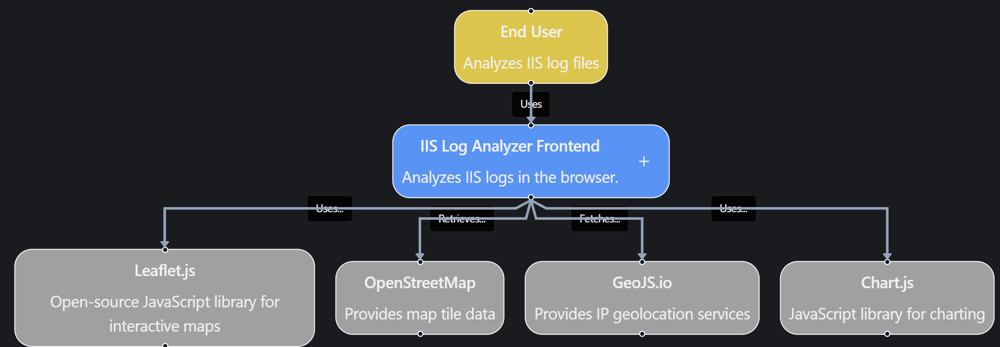

# IIS Log Analyzer (Client-Side)

🇬🇧 English | 🇪🇸 [Español](README.es.md)

A web tool to analyze **Microsoft IIS log files** directly in the browser.
It allows visualizing metrics, detecting attack patterns, and exploring log records without uploading files to a server.

All processing is done **client-side (JavaScript)**.

## Features

* IIS log file analysis
* **100% browser-based processing**
* Metrics visualization using charts
* Interactive log table
* Quick IP filtering
* Automatic identification of:

  * Bots
  * Scanners
  * Possible attacks
  * Private IPs are excluded from analysis
* IP ranking
* Detection of possible brute force attacks
* Traffic origin map

## Available Charts

* **HTTP status code** distribution
* **HTTP method** distribution
* **Requests per hour**
* Detected **attack types**

Charts are generated using **Chart.js**.

## Supported Log Format

Logs generated by **Microsoft IIS** using the standard **W3C log format**.

Example:

```
#Fields: date time s-ip cs-method cs-uri-stem cs-uri-query s-port cs-username c-ip cs(User-Agent) sc-status sc-substatus sc-win32-status time-taken
2026-03-07 10:15:32 192.168.1.10 GET /index.html - 80 - 203.0.113.15 Mozilla/5.0 200 0 0 45
```

## Usage

1. Open the page in your browser
2. Select an IIS log file
3. The system will automatically process the file
4. The following will be displayed:

* metrics
* charts
* log records

## Filtering

Log records can be filtered using:

* search field
* clicking an IP address in the table

## Performance

The parser is optimized to handle large files (further improvements planned).

Implemented optimizations:

* reuse of `Intl.DateTimeFormat`
* optimized table rendering
* destruction of chart instances

## Technologies Used

* HTML5
* CSS
* JavaScript
* Bootstrap
* Chart.js

## Security

Log files **are not sent to any server**.
All analysis is performed locally in the user's browser.

This allows analyzing sensitive logs without risk of exposure.

## Limitations

Due to browser limitations:

* extremely large files (>1M lines) may require additional optimizations
* performance depends on the available browser memory

## Possible Future Improvements

* performance improvements for very large log files
* country-based traffic analysis
* more advanced attack pattern detection
* more complex filters
* multiple file analysis

## Codebase map

## Screenshots

### Overview


### Log Table


### IP Filtering


## Notes

Some parts of this project were developed with the assistance of AI tools to generate and improve code and documentation fragments.

## License

MIT License
